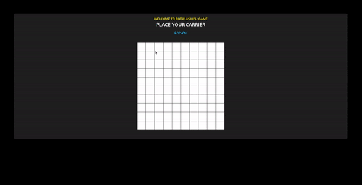

# Butulushipu

# Odin Project - Battleship project challange

This is a solution to Odin Projects Battleship challange

## Table of contents

- [Overview](#overview)
  - [Screenshot](#screenshot)
  - [Links](#links)
- [What I've learned](#Learned)
- [Author](#author)

## Overview

This is old and well known game, with simple ui, worked with js objects, used jest to test functions, first time tried TDD.

### Screenshot

### Links

[Click to view live site](https://gwynbleidd0014.github.io/Battleship/)

## Learned

TDD and jest.

## Author

Hello, I'm Ucha, you might know me as [gwynbleidd0014](https://github.com/gwynbleidd0014) on github
